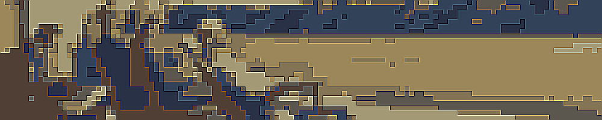

# Bowser Hopper



## Description

Edward Hopper (1882-1967) was an iconic American painter known for capturing the solitude and alienation inherent in modern life. His most famous piece, **Nighthawks**, showcases people in a diner late at night, close yet distant in their personal bubbles, a perfect metaphor for modern isolation.

Hopper’s paintings, such as **Nighthawks**, reveal the quiet, often overlooked moments of personal solitude that saturate American life. His art not only critiques the urban experience but also explores deeper emotions like melancholy, yearning, and introspection. This exploration resonates with modern audiences, reflecting ongoing issues of connectivity, psychological impact of urban environments, and the paradoxical loneliness of crowded spaces. His legacy continues to inspire and provoke thought about the architecture of loneliness and the intimate moments of human experience amidst the ever-present crowd.

## Use

Make use of this repo's main.py file and define your parameters to your liking 

```python
folder_path = os.path.join(base_dir, 'paintings', 'ind')
name = os.path.join(base_dir, 'pixelated_hopper.gif')

images = load_images(folder_path= folder_path, desired_size=(1000, 200))
cartoon_images = [apply_cartoon_effect(pixelate_image(img, pixel_size = 5), levels= 10) for img in images]

all_frames = []
for i in range(len(cartoon_images) - 1):
    all_frames += create_transition_frames(cartoon_images[i], cartoon_images[i+1], steps=15)

all_frames += create_transition_frames(cartoon_images[-1], cartoon_images[0], steps=15)
all_frames[0].save(name, save_all=True, append_images=all_frames[1:], optimize=False, duration=150, loop=0)
```

Make sure to fork and share any ideas!
